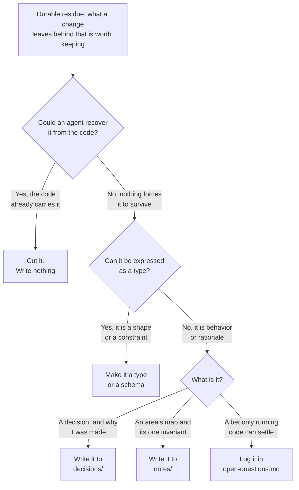
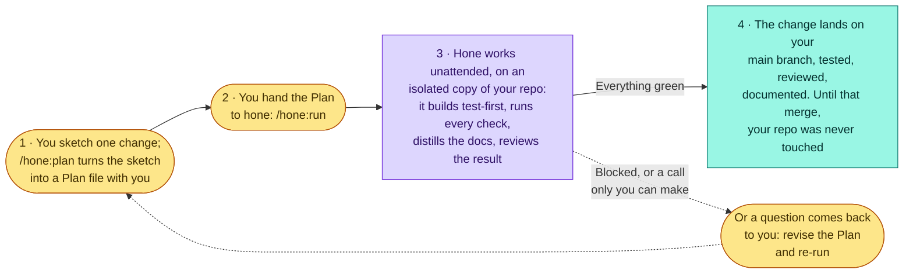
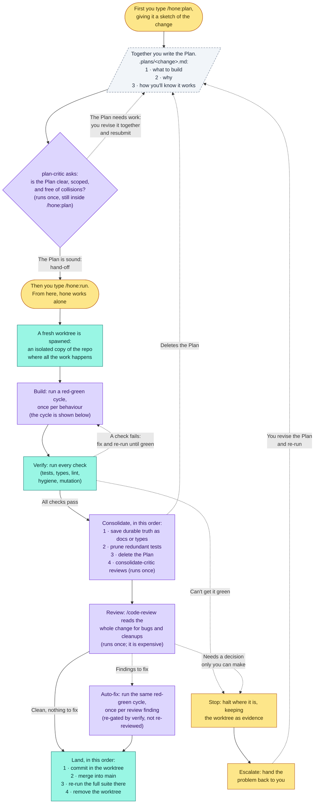
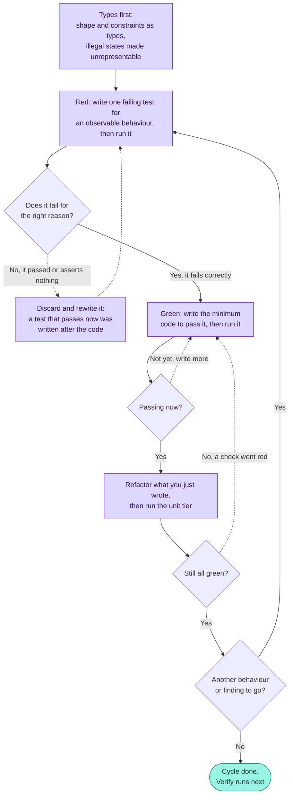
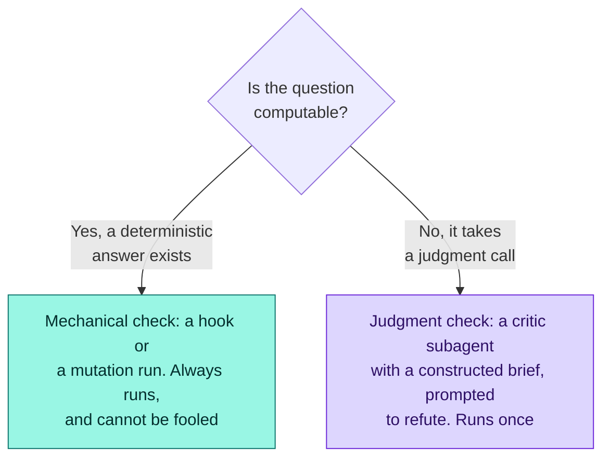

# hone — a development model for AI-written codebases

*To hone is to sharpen a blade by grinding material away — refinement through
removal.* hone is a development model for codebases where an AI agent is a primary
writer *and* reader. It enforces the discipline of test-driven work but carries no
rot-prone corpus: there is no hand-maintained per-feature specification pile. It
refines the codebase by cutting: only rot-proof truth survives, and every cycle
removes something. Language-agnostic; examples use TypeScript and Python.

## The problem

Hand-maintained, per-feature behavioral specs serve two tenses at once: the
*temporary* work-ticket (what we're building now, its criteria, its checkboxes)
and the *permanent* description (how the system behaves today). Every batch of work
mints a new file and criteria are only ever added, so truth for one feature
scatters across many files and the pile grows without bound. Hand-maintained
behavioral prose always rots. It is a second copy of the system's behaviour that
nothing forces to stay in step with the code.

## Principles

1. *Discipline without a corpus.* Test-first is enforced; nothing maintains a
   permanent pile of per-feature specs.
2. *Durable truth lives only where it can't rot.* Everything else is disposable.
3. *The cut test.* Never write a durable line an agent could recover from the
   code, and if it can be a type, it is a type, not prose.
4. *Deletion is routine.* Every cycle removes something, counterbalancing a
   machine that otherwise only adds.
5. *The human plans; automation executes.* After the Plan, the loop runs
   unattended: hooks enforce the laws, critics fill the judgment slots, and it
   *escalates instead of forcing past a failed check*.
6. *All work happens in a worktree.* The primary tree is a merge target, never
   a workspace.

## Artifacts

At consolidate, each piece of durable residue is routed by a fixed test — cut
first, then type, then the smallest doc that fits:



*Durable — committed, survive the change:*

- *Types / schemas*: static types (TS; Python under mypy/pyright) and
  boundary/data schemas (Zod, Pydantic, JSON Schema, the DB schema). The
  strongest carrier: a checker fails when code and contract disagree, so they
  cannot drift.
- *Code*: `src/<area>/` (`thing.ts`, `thing.py`). The behavior itself.
- *Tests*: colocated by language convention (`thing.test.ts`,
  `test_thing.py`), behavior-named. Verify the *what* and document it.
- *Decision*: `docs/decisions/<topic>.md`. Present-tense: the current decision +
  why, plus a rejected-alternatives line when it's load-bearing (to stop a dead
  option being re-proposed). Edited freely when the decision changes; git carries
  the history and the commit message the why-it-changed. One per topic, landing
  in the same commit as the code it governs.
- *Note*: `docs/notes/<area>.md`. Per-area map + its one invariant, pointing
  at the Decision and the key types. Optional, 1:1 with an area, size-capped.
- *Open question*: `docs/open-questions.md`. A bet only running code settles.
  Closed or deleted, never grown.
- *Git history*: what changed and why now.

*Ephemeral — tracked, but removed at consolidate:*

- *Plan*: `.plans/<change>.md`. The per-change brief: what, why, how I'll know
  it works. The only hand-written artifact; committed at `plan` (so the run's
  worktree inherits it off the trunk), then `git rm`'d at consolidate — the
  landing merge carries the deletion, git history keeps the Plan, the working
  tree does not.

*Enforcement — config, not docs:*

- *guard*: no production code without a failing test; no durable edits
  (`src/`, `tests/`, `docs/`, `db/`, plus `.hone-durable-paths` extensions) in
  the primary tree.
- *gate*: tests green, plus type-check and lint where the language has them
  (one adapter script keeps the hook language-agnostic).
- *nag*: leftover Plan, oversized Note, orphan Note, a merged `hone/*` branch
  land forgot to delete, a change about to land that deletes nothing.

## The loop

*From your side*, two commands in, a landed change out, or a question handed
back to you:



*In full.* Nodes are colored by actor: *user command* (amber), *deterministic*
mechanical step (teal), *stochastic* model step (violet); the dashed
parallelogram is
the Plan, the one hand-written artifact. Work starts with a command: `/hone:plan`
takes your sketch and writes `.plans/<change>.md` with you; then `/hone:run`
launches everything downstream (`/hone:run --all` fans out over many Plans). Each
slash command is a discrete step; between them the loop runs itself. The Plan's
whole life is on the diagram: born at `/hone:plan`, deleted at consolidate.



Both `build` and `auto-fix` run the same red-green cycle, the loop's one
repeating unit. It is shown in full once:



- *plan* (`/hone:plan`): author `.plans/<change>.md`. The only manual step. Size
  a change to the smallest unit worth its own review gate: split only where a
  reviewer could reject one part while approving its neighbor. It ends with
  *admission*: `plan-critic` checks placeholders, contradictions, ambiguity,
  scope, and collision with an open change, and a rejection is revised with the
  human on the spot — the one moment they are guaranteed present — so no flawed
  Plan is handed off.
- *run* (`/hone:run`): per Plan, in a fresh worktree:
  - *build*: red-green: type, failing test, then code; `guard` enforces the
    order.
  - *verify*: `gate` and `nag`, plus a mutation check on critical paths.
  - *consolidate*: route durable residue (a type, a Decision, a Note, a closed
    question), prune redundant tests, delete the Plan; `consolidate-critic`
    reviews.
  - *review*: Claude Code's built-in `/code-review` on the finished change.
  - *land*: commit, merge into the primary tree, re-run the whole suite there,
    remove the worktree.

Every step's completion is confirmed by its artifacts (the diff, the gate
output), never by a subagent's report that it finished. A failed check is not a
stop, and only the `build`⇄`verify` cycle loops: a red gate or a surviving mutant
sends the agent back to `build` for another red-green cycle, as many times as it
takes to go green. The model checks each change *once* per slot: `plan-critic`
(at `/hone:plan`), `consolidate-critic`, and the expensive `/code-review`; their findings are
applied or auto-fixed in place, and a review fix is a red-green cycle re-gated by
`verify`, never a second review. A confirmed finding may be declined only when
it contradicts the Plan's explicit stance or falls outside the change, and the
decline is recorded durably (the landing commit's body, or an open question for
a deferred defect), never left in the conversation alone. The agent self-corrects in the worktree and
escalates only at the two stop-points on the diagram: verify can't go green once
the fix is exhausted, or review finds the change genuinely ambiguous. (A flawed
Plan never reaches `run`: admission rejects it inside `/hone:plan`, where the
human is present to revise it.) On a stop it leaves the worktree in place as evidence; the
human revises the Plan and re-runs (or abandons the change), never disabling a
gate to proceed. The Plan is the sole re-entry point: the human does not hand-fix
code mid-loop.

*A bug fix is the same loop:* `build` opens with a failing test that reproduces
the defect, then fixes the root cause, never a fix confirmed by a test written
after. *Exploration is not:* a spike runs in a throwaway worktree that is
discarded, never landed; its finding becomes a Decision or a Note, not committed
code.

## Checking

Two kinds of checker; choosing the wrong kind is the main failure.



*Mechanical.* Deterministic, no model calls, unfoolable, always run: the hooks
above plus mutation testing. Prefer mechanical wherever the question is
computable.

*Judgment.* Subagents, only where no hook can answer. Each gets a *constructed*
brief (the diff, the Plan, the relevant Decisions and Notes), never the writer's
transcript; inheriting the writer's context is not independent review. It is
prompted to *refute and argue for deletion* rather than approve, and runs *once*,
returning structured findings.

- `plan-critic`: placeholders, contradictions, ambiguity, scope; belongs in an
  existing area? Runs inside `/hone:plan`, so a rejection is revised with the
  human present rather than escalated mid-run.
- `consolidate-critic`: Decision restating code? Note drifting into a spec?
  redundant test? abstraction earning its keep?
- `/code-review`: Claude Code's built-in workflow-backed command for correctness
  plus what to delete; already multi-agent (parallel finders + a verification
  pass), so the loop reuses it rather than shipping its own reviewer. Model
  invocation of the command is now disabled, so the loop runs it as an explicit
  user invocation in a nested headless Claude Code (a print-mode `/code-review`)
  reading the worktree diff; it must not fall through to a marketplace
  `code-review` plugin, which is GitHub-PR-shaped.

These critics are the only judgment inside the loop; together with the
mechanical checks they are the whole trust foundation. The human's judgment
sits before (the Plan) and after (auditing the merged result).

The critic prompts and the injected `rules/workflow.md` are themselves
behavior-shaping prose doing real judgment work. Check them against evals (a
suite of past changes with known-good verdicts) rather than assuming they hold;
unverified prose is the one part of the trust foundation that can rot silently.

### Property-based tests (build-time)

A property states a rule once (`parse(serialize(x)) == x`) and a fuzzer
hammers it, so the writer cannot game inputs it does not pick. *Use* for
modules with a universal invariant: parsers, serializers, pure transforms,
especially on critical paths. *Skip* where no universal rule exists: UI,
orchestration, glue. Complements, never replaces, example tests that pin
specific behavior.

### Mutation tests (verify-time)

Seed small bugs and check a test catches them: the unfoolable judge of hollow
tests, which matters because the same agent wrote the code and the tests. *Use*
diff-scoped and budget-capped, on critical paths only. *Skip* whole-suite runs
(cost, noise) and UI behavior; it audits the tests, not the code, and never
gates a trivial change. Runner maturity varies by ecosystem (StrykerJS for
JS/TS; mutmut or cosmic-ray for Python), so check before relying on it.

Both are *verification independent of the author*: the writer can game its own
examples and its own self-review, but not a fuzzed property or a seeded mutant.

## Types and abstractions

Anything expressible as a type belongs in a type, not prose: an interface, a
constraint, an illegal state made unrepresentable (a discriminated union in TS,
a `Literal` in Python). Types carry *shape and constraint*; behavior stays in
tests, *why* in Decisions.

Their failure mode is over-abstraction, not rot, and no checker flags it: a
type checker verifies a type is correct, never that it is wise. (Where checking
is opt-in, as with mypy or pyright, adopting it is a deliberate choice; the
discipline matters more, not less.) So abstractions are judged *reactively, at
the point of change*, never by proactive hunt, since hunting breeds premature
abstraction:

- At *build*, friction is the signal. Rule of three: duplicate until the
  abstraction proves itself.
- At *consolidate*, `consolidate-critic` asks whether the change *revealed* a
  wrong abstraction (a generic with one caller; two types that should merge).
  This named slot is essential: nothing else forces the look.
- What is not being changed is not managed. A bad abstraction costs only at
  change-time. Exception: *recurring* friction on a foundational type across
  several changes triggers a deliberate, Decision-level reconsideration.

## Many changes at once

Parallelism is `run` over several Plans, each in its own worktree, landed one
at a time, not a special mode. Three rules:

- *Within a change the loop is serial.* Each red-green cycle learns from the
  last; the unit of parallelism is the change, never the cycles inside it.
- *Independence is checked before fan-out, never assumed.* Each `plan-critic`
  ran at plan time, before later Plans existed, so `run` compares the complete
  set first — expected files and areas, shared types and persistent contracts,
  Decisions and Notes more than one Plan would touch — and partitions:
  disjoint Plans fan out in parallel; overlapping Plans run sequentially, each
  landing before the next starts, so the later change builds on the landed
  result.
- *Independence is verified at the merge.* A merge collision on a shared type
  or Note means the upfront check missed a seam: that seam becomes one serial
  change and a Decision-level reconsideration. After all merges, a *global
  consolidate pass* catches cross-change duplication no single worktree could
  see.

`/hone:run --all` fans a worktree agent out per independent Plan, sequences the
overlapping ones, and lands them all through the same conservative
merge-and-verify stage.

## Filetree

```
hone/                            # the plugin — the machinery (installs once)
├── .claude-plugin/plugin.json
├── rules/workflow.md            # lean always-on trigger, injected at session start
├── skills/{plan,run}/SKILL.md   # /hone:plan, /hone:run
├── hooks/                       # the laws
│   ├── {guard,gate,nag}.sh + hooks.json
│   ├── bash-guard.sh            # tamper resistance for the gate
│   └── session-start.sh         # injects rules/workflow.md; nudges setup
├── scripts/{worktree,setup}.sh  # worktree add/land/remove; one-time project setup
├── agents/{plan-critic,consolidate-critic}.md   # the judgment (review reuses /code-review)
├── templates/run-tests/         # the one test-adapter contract, per ecosystem
└── evals/                       # known-good verdicts for the critics and the rule

repo/  (primary tree — a merge target, never worked in)
├── src/<area>/                  # code + tests: thing.ts/thing.test.ts,
│                                #               thing.py/test_thing.py, ...
├── docs/{decisions/, notes/, open-questions.md}
├── scripts/run-tests.sh         # the test adapter (installed by setup.sh)
├── .plans/<change>.md           # tracked — hand-written; git-rm'd at consolidate
├── .worktrees/<change>/         # gitignored — one per in-flight change
└── .claude/settings.json        # enables the plugin; deny-rules protect gates
```

`rules/workflow.md` is a *pointer, not the manual*: a paragraph naming the
plan→run workflow and its invariants, so the always-on context stays cheap and
gets obeyed (a long always-on rule burns the budget every session and is ignored
once it grows). The operational detail lives in the `plan` and `run` skills,
loaded only when invoked (progressive disclosure). For a single repo rather than
a distributed plugin, that trigger is just as well a lean `CLAUDE.md` pointing at
local skills; the detail-in-skills split is the same either way.


## What writes what

W = writes · M = amends · P = prunes/deletes · R = reads · — = untouched

| Operation   | .plans/ | code | tests | decisions/ | notes/ | open-q | .git |
|-------------|---------|------|-------|------------|--------|--------|------|
| plan        | W       | —    | —     | —          | —      | (W)    | W    |
| build       | R       | W    | W     | —          | —      | —      | —    |
| verify      | —       | R    | R     | R          | R      | R      | —    |
| consolidate | P       | —    | P     | W/M        | W/M    | M      | —    |
| land        | —       | —    | —     | —          | —      | —      | W    |

(W) on open-q: only when the Plan surfaces a new open question. plan's `.git` W
is the Plan commit on the trunk (so the run's worktree inherits it); consolidate's
`.plans/` P is a `git rm` staged in the worktree that land's commit and merge
carry back to the primary tree.

## Invariants

1. Code and tests are written only by *build* (and pruned only by
   *consolidate*); `docs/` is written only by *consolidate*;
   `.plans/` deleted only by *consolidate*. Work-in-progress cannot leak into
   durable truth: the structural cure for the spec pile.
2. A Note is optional, 1:1 with an existing area, and size-capped, held by the
   correspondence and size checks; the *carving* of areas is judged by
   `/code-review`.
3. Every `docs/` write passes the cut test (principle 3).
4. The primary tree's durable artifacts are written only by *land*, a merge;
   `guard` blocks direct source edits there, so no half-built change ever sits
   in the tree everything merges into. The one hand-authored exception is the
   Plan (`.plans/`, outside `guard`'s perimeter), committed there at *plan* so
   the run's worktree inherits it and land's merge can remove it.
