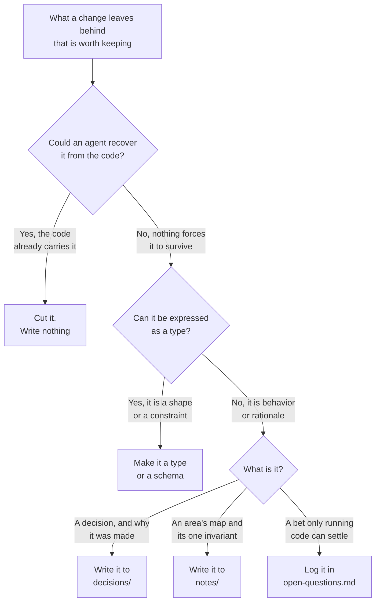
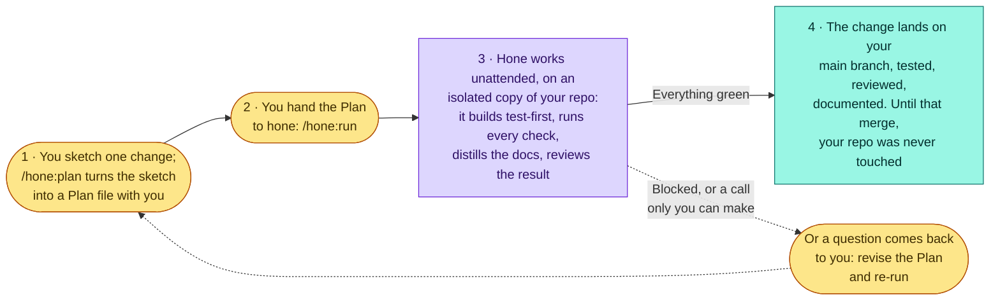
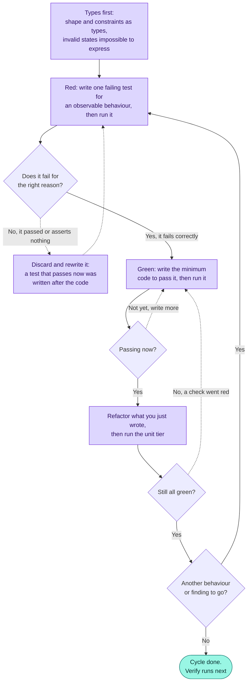
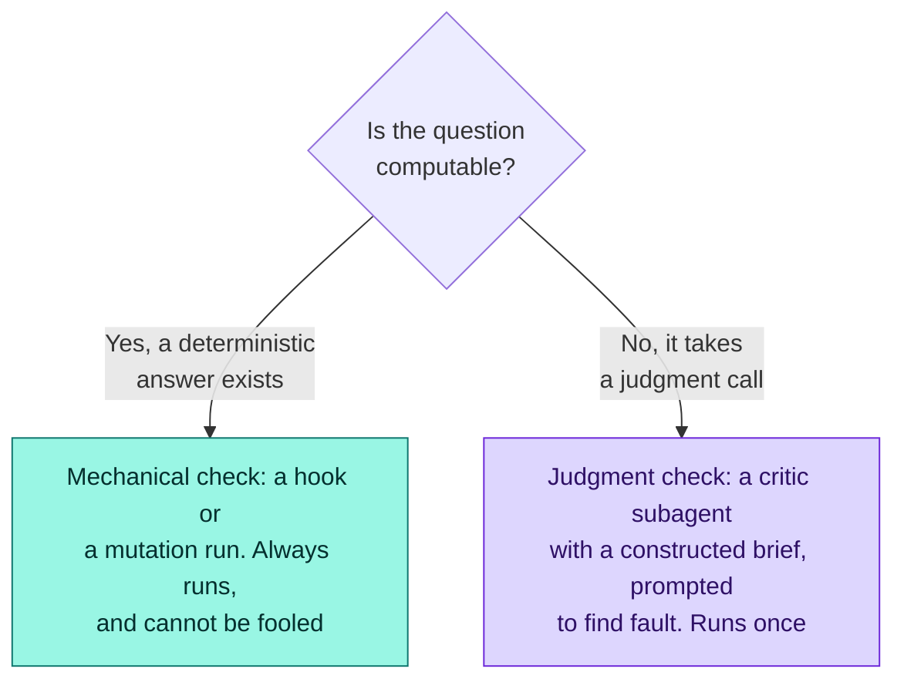

# hone: a development model for AI-written codebases

hone is a development model for codebases where an AI agent is a primary
writer *and* reader. It enforces test-driven work, but keeps no pile of
per-feature specification prose: permanent documentation is limited to forms
that are either checked mechanically or too small to rot unnoticed, and every
change is expected to delete something. This page explains why the pieces
exist; the operational detail (commands, files, exit codes) is in
[`reference.md`](reference.md). Examples use TypeScript and Python; the model
is language-agnostic.

## The problem

Hand-maintained per-feature specs serve two purposes at once: the temporary
work ticket (what we're building now, its criteria) and the permanent
description (how the system behaves today). Every batch of work adds a file,
criteria only ever accumulate, and the truth about one feature ends up
scattered across many documents. Nothing forces any of that prose to stay in
step with the code, so it goes stale — it is a second copy of the system's
behavior with no checker attached.

## Principles

1. *Discipline without a corpus.* Test-first is enforced; no permanent pile
   of per-feature specs is maintained.
2. *Permanent docs live only where staleness gets caught.* Everything else is
   disposable.
3. *The cut test.* Never write down what an agent could work out from the
   code, and if something can be a type, make it a type instead of prose.
4. *Deletion is routine.* Every change should remove something; this
   counterbalances a machine that otherwise only adds.
5. *The human plans; automation executes.* After the plan, the loop runs
   unattended: hooks enforce the rules, critic agents make the judgment
   calls, and the loop stops and reports rather than forcing past a failed
   check.
6. *All work happens in a worktree.* The primary tree is a merge target,
   never a workspace.

## Artifacts

At consolidate, whatever a change leaves behind that is worth keeping is
routed by a fixed test — cut first, then type, then the smallest document
that fits:

```mermaid
flowchart TD
    r["What a change leaves behind<br/>that is worth keeping"] --> cut{"Could an agent recover<br/>it from the code?"}
    cut -->|"Yes, the code<br/>already carries it"| drop["Cut it.<br/>Write nothing"]
    cut -->|"No, nothing forces<br/>it to survive"| shape{"Can it be expressed<br/>as a type?"}
    shape -->|"Yes, it is a shape<br/>or a constraint"| type["Make it a type<br/>or a schema"]
    shape -->|"No, it is behavior<br/>or rationale"| kind{"What is it?"}
    kind -->|"A decision, and why<br/>it was made"| dec["Write it to<br/>decisions/"]
    kind -->|"An area's map and<br/>its one invariant"| note["Write it to<br/>notes/"]
    kind -->|"A bet only running<br/>code can settle"| oq["Log it in<br/>open-questions.md"]
```

*Committed and permanent — these survive the change:*

- *Types and schemas*: static types (TypeScript; Python under mypy or
  pyright) and boundary schemas (Zod, Pydantic, JSON Schema, the DB schema).
  The strongest form, because a checker fails when code and contract
  disagree.
- *Code*: `src/<area>/`. The behavior itself.
- *Tests*: colocated by language convention, named for the behavior they
  pin. They both verify and document what the system does.
- *Decisions*: `docs/decisions/<topic>.md`. Present tense: the current
  decision and why, plus a rejected alternative when recording it stops a
  dead option from being proposed again. One file per topic, edited in place
  when the decision changes (git keeps the history), landing in the same
  commit as the code it governs. An optional `Governs:` line names the
  `src/` paths the decision explains; the nag flags the file when a named
  path stops existing, which is how prose drift gets caught mechanically.
- *Notes*: `docs/notes/<area>.md`. An optional per-area map plus its one
  invariant, pointing at the relevant Decision and key types. One per
  existing `src/` area at most, size-capped. Its pointers can also be a
  `Governs:` line, checked the same way.
- *Open questions*: `docs/open-questions.md`. Assumptions only running code
  can settle. Entries get closed or deleted, never accumulated.
- *Git history*: what changed and why, at each point in time.

*Tracked but temporary — removed when the change lands:*

- *The Plan*: `.plans/<change>.md`. The per-change brief: what to build, why,
  how you'll know it works. The only hand-written artifact. Committed at
  `plan` so the run's worktree (created off the trunk) contains it; deleted
  with `git rm` at consolidate, so the landing merge removes it from the
  working tree while git history keeps it.
- *References*: `.plans/<change>/`. Optional files the Plan names because
  prose carries them badly: a fixture of input/expected rows, a sample
  payload, a mockup. They exist because every gate in the loop catches a
  change that is *unproven*, but none catches one that is *misunderstood* —
  an ambiguous plan can pass every check and land green and wrong. A concrete
  file removes the second reading while the human is still present. Each
  reference is either promoted at build (moved next to the test that reads
  it, and from then on kept honest by the suite) or deleted at consolidate
  with the Plan, so references never become a second prose layer.

*Not permanent, wherever it lives: the harness's own memory.*

Claude Code keeps per-project memory outside the repo (one file per fact
under `~/.claude/projects/<project>/memory/`). For facts about the human —
who they are, how they like to work, where a dashboard lives — that store is
fine and none of hone's business. But a project decision or constraint saved
there fails every requirement this model sets for permanent docs: it is
per-user, uncommitted, unreviewed, and invisible to the hooks, the critics,
and `garden`, so nothing ever corrects it. The nag flags memory entries typed
`project` (it never edits them — the file is the human's); the fix is to land
the content in `docs/` through consolidate, where it can be reviewed and
eventually cut.

*Enforcement:* the guard, gate, nag, and bash-guard hooks, described in
[`reference.md`](reference.md). In short: no production code without a
failing test, no direct edits to protected paths in the primary tree, tests
and type-check and lint green before a turn ends, and hygiene findings
reported visibly.

## The loop

From your side: two commands in, a landed change out, or a question handed
back to you.

```mermaid
flowchart LR
    you1(["1 · You sketch one change;<br/>/hone:plan turns the sketch<br/>into a Plan file with you"])
    you2(["2 · You hand the Plan<br/>to hone: /hone:run"])
    machine["3 · Hone works unattended, on an<br/>isolated copy of your repo:<br/>it builds test-first, runs every check,<br/>distills the docs, reviews the result"]
    landed["4 · The change lands on your<br/>main branch, tested, reviewed,<br/>documented. Until that merge,<br/>your repo was never touched"]
    back(["Or a question comes back<br/>to you: revise the Plan<br/>and re-run"])

    you1 --> you2 --> machine
    machine -->|"Everything green"| landed
    machine -.->|"Blocked, or a call<br/>only you can make"| back
    back -.-> you1

    classDef human fill:#fde68a,stroke:#b45309,color:#3f2d00;
    classDef machine fill:#ddd6fe,stroke:#6d28d9,color:#2e1065;
    classDef result fill:#99f6e4,stroke:#0f766e,color:#042f2e;
    class you1,you2,back human;
    class machine machine;
    class landed result;
```

In full, with nodes colored by actor — *user command* (amber), *mechanical
step* (teal: scripted, same result every time), *model step* (violet: a
judgment call, so its outcome can vary) — and the Plan as the dashed
parallelogram. The Plan's whole life is on the diagram: created at
`/hone:plan`, deleted at consolidate.

```mermaid
flowchart TD
    cmdPlan(["First you type /hone:plan,<br/>giving it a sketch of the change"])
    planFile[/"Together you write the Plan.<br/>.plans/&lt;change&gt;.md:<br/>1 · what to build<br/>2 · why<br/>3 · how you'll know it works"/]
    cmdRun(["Then you type /hone:run.<br/>From here, hone works alone"])
    admit{"plan-critic asks:<br/>is the Plan clear, scoped,<br/>and free of collisions?<br/>(runs once, still inside /hone:plan)"}
    wt["A fresh worktree is spawned:<br/>an isolated copy of the repo<br/>where all the work happens"]
    build["Build: run a red-green cycle,<br/>once per behaviour<br/>(the cycle is shown below)"]
    verify["Verify: run every check<br/>(tests, types, lint,<br/>hygiene, mutation)"]
    cons["Consolidate, in this order:<br/>1 · save what must survive as docs or types<br/>2 · prune redundant tests<br/>3 · delete the Plan<br/>4 · consolidate-critic reviews (runs once)"]
    rev["Review: /code-review reads the<br/>whole change for bugs and cleanups<br/>(runs once; it is expensive)"]
    fix["Auto-fix: run the same red-green cycle,<br/>once per review finding<br/>(re-gated by verify, not re-reviewed)"]
    land["Land, in this order:<br/>1 · commit in the worktree<br/>2 · merge into main<br/>3 · re-run the full suite there<br/>4 · remove the worktree"]
    esc["Escalate: hand the<br/>problem back to you"]
    stop["Stop: halt where it is, keeping<br/>the worktree as evidence"]

    cmdPlan --> planFile
    planFile --> admit
    admit -->|"The Plan is sound:<br/>hand-off"| cmdRun
    admit -.->|"The Plan needs work:<br/>you revise it together<br/>and resubmit"| planFile
    cmdRun --> wt
    wt --> build
    build --> verify
    verify -->|"All checks pass"| cons
    verify -.->|"A check fails:<br/>fix and re-run until green"| build
    verify -.->|"Can't get it green"| stop
    cons --> rev
    cons -.->|"Deletes the Plan"| planFile
    rev -->|"Clean, nothing to fix"| land
    rev -.->|"Findings to fix"| fix
    fix --> land
    rev -.->|"Needs a decision<br/>only you can make"| stop
    land -.->|"Irreversible or real-environment:<br/>awaits your grant or proof<br/>(the land gates)"| stop
    stop --> esc
    esc -.->|"You revise the Plan<br/>and re-run"| planFile

    classDef human fill:#fde68a,stroke:#b45309,color:#3f2d00;
    classDef deterministic fill:#99f6e4,stroke:#0f766e,color:#042f2e;
    classDef stochastic fill:#ddd6fe,stroke:#6d28d9,color:#2e1065;
    classDef artifact fill:#f1f5f9,stroke:#64748b,color:#1e293b,stroke-dasharray:5 3;
    class cmdPlan,cmdRun,esc,stop human;
    class wt,verify,land deterministic;
    class admit,build,cons,rev,fix stochastic;
    class planFile artifact;
```

Both `build` and `auto-fix` run the same red-green cycle, the loop's one
repeating unit:

```mermaid
flowchart TD
    ty["Types first:<br/>shape and constraints as types,<br/>invalid states impossible to express"]
    red["Red: write one failing test for<br/>an observable behaviour, then run it"]
    q1{"Does it fail for<br/>the right reason?"}
    disc["Discard and rewrite it:<br/>a test that passes now was<br/>written after the code"]
    green["Green: write the minimum<br/>code to pass it, then run it"]
    q2{"Passing now?"}
    refac["Refactor what you just wrote,<br/>then run the unit tier"]
    q3{"Still all green?"}
    more{"Another behaviour<br/>or finding to go?"}
    done(["Cycle done.<br/>Verify runs next"])

    ty --> red --> q1
    q1 -.->|"No, it passed or asserts nothing"| disc
    disc -.-> red
    q1 -->|"Yes, it fails correctly"| green
    green --> q2
    q2 -.->|"Not yet, write more"| green
    q2 -->|"Yes"| refac
    refac --> q3
    q3 -.->|"No, a check went red"| green
    q3 -->|"Yes"| more
    more -->|"Yes"| red
    more -->|"No"| done

    classDef stochastic fill:#ddd6fe,stroke:#6d28d9,color:#2e1065;
    classDef deterministic fill:#99f6e4,stroke:#0f766e,color:#042f2e;
    class ty,red,green,refac,disc stochastic;
    class done deterministic;
```

The steps, briefly:

- *plan* (`/hone:plan`): write `.plans/<change>.md`, plus any reference files
  the change depends on. The only manual step. Size a change to the smallest
  unit worth its own review: split only where a reviewer could reject one
  part while approving the other. The step ends with the `plan-critic`
  checking for placeholders, contradictions, ambiguity, wrong scope, and
  collisions with open changes — while you are still present to fix a
  rejection, so no flawed plan is handed to the unattended run.
- *run* (`/hone:run`), per plan, in a fresh worktree:
  - *build*: types, then a failing test, then code, repeated per behavior;
    the guard enforces the order.
  - *verify*: the gate (suite, types, lint) and the nag, plus a mutation
    check on critical paths.
  - *consolidate*: route what the change leaves behind (see *Artifacts*),
    prune redundant tests, delete the Plan; the `consolidate-critic` then
    argues for further cuts.
  - *review*: Claude Code's built-in `/code-review` on the finished change.
  - *land*: commit, merge into the primary tree, re-run the whole suite
    there, remove the worktree.

Rules that hold throughout: each step's completion is confirmed by its
artifacts (the diff, the gate output, the review's JSON envelope), never by a
subagent's claim that it finished. A failed check is not a stop — only the
build⇄verify cycle loops, as many times as it takes. Each judgment check runs
once per change (`plan-critic` at plan time, `consolidate-critic`, and the
expensive `/code-review`); review findings are fixed with red-green cycles
and re-verified, not re-reviewed. A confirmed finding may be declined only
when it contradicts the Plan's explicit position or falls outside the change,
and the decline is recorded where it survives — the landing commit body, or
an open question for a deferred defect — never only in conversation. The run
stops in exactly three cases: verify can't go green and the fixes are
exhausted; the change is genuinely ambiguous; or done. On a stop it leaves
the worktree in place and reports the specific blocker. The human's response
is to revise the Plan and re-run (or abandon the change) — never to disable a
check, and never to hand-edit code mid-loop: the Plan is the only re-entry
point.

A bug fix is the same loop, with the first red test reproducing the defect
before the fix — never a fix confirmed by a test written afterwards. A spike
is not: exploration runs in a throwaway worktree that is discarded, and its
conclusion becomes a Decision or a Note, not committed code.

## Checking

Two kinds of checker, and choosing the wrong kind is the main failure:

```mermaid
flowchart TD
    q{"Is the question<br/>computable?"}
    q -->|"Yes, a deterministic<br/>answer exists"| mech["Mechanical check: a hook or<br/>a mutation run. Always runs,<br/>and cannot be fooled"]
    q -->|"No, it takes<br/>a judgment call"| judge["Judgment check: a critic subagent<br/>with a constructed brief, prompted<br/>to find fault. Runs once"]

    classDef deterministic fill:#99f6e4,stroke:#0f766e,color:#042f2e;
    classDef stochastic fill:#ddd6fe,stroke:#6d28d9,color:#2e1065;
    class mech deterministic;
    class judge stochastic;
```

*Mechanical checks* are scripted, produce the same result every time, cannot
be argued with, and always run: the hooks, plus mutation testing. Prefer them
wherever the question is computable.

*Judgment checks* are subagents, used only where no script can answer. Each
gets a *constructed* brief — the diff, the Plan, the relevant Decisions and
Notes — never the writer's transcript, because a reviewer that inherits the
writer's context is not an independent reviewer. Each is prompted to find
fault and argue for deletion rather than to approve, runs once, and returns
structured findings.

- `plan-critic`: placeholders, contradictions, ambiguity, scope, prose
  carrying data a file should carry, collisions with open changes. Runs
  inside `/hone:plan` so rejections are fixed with the human present.
- `consolidate-critic`: is a Decision just restating code? has a Note grown
  into a spec? is a test redundant? is an abstraction earning its keep?
- `/code-review`: Claude Code's built-in review command, already multi-agent
  (parallel finders plus a verification pass), so the loop reuses it instead
  of shipping its own reviewer. The command refuses model invocation, so the
  loop runs it as a print-mode user turn in a nested headless Claude Code —
  see the run skill and its references for the exact procedure.

These checks are the whole trust foundation of the unattended stretch; the
human's judgment sits before it (the Plan) and after it (auditing what
landed).

One part of that foundation can still rot silently: the prompts themselves.
The critic prompts, the run skill, and the injected workflow rule are prose
doing real work, and nothing type-checks a prompt. `evals/` holds a suite of
cases with known-good answers (a verdict for each critic case, a next action
for each loop case); run it after any change to that prose. The evals are
also what make *cutting* prompt text safe — as models improve, spelled-out
instructions become unnecessary one by one, but which ones is an empirical
question. Trim, re-run, keep what holds. Without such a suite, a cut is a
guess about future behavior, which is why `garden` refuses to cut prompt
files in repos that lack one.

### The proof boundary (land-time)

Everything above — suite, types, lint, property tests, mutation checks — runs
inside the repo, before the merge, needing nothing from the outside world. A
green check therefore proves only what it asserts; it can never prove a
browser journey, a canary, or deployed health. For a change whose real claim
lives out there, "landed, tested, reviewed" is not "proven".

So the boundary is stated explicitly: a Plan whose proof is user- or
ops-level declares `Proof: real-environment` (the `plan-critic` rejects a
plan whose named proof is categorically unable to settle its claim), and
`land` refuses such a change (exit 7, worktree kept) until either
`scripts/proof.sh` — a real-environment check run from the change's worktree
— passes, or a human runs the check and signs it off. The sign-off names the
commit it covers, so it expires when new commits are pushed. Mechanics in
[`reference.md`](reference.md).

### Property-based tests (build-time)

A property test states a rule once (`parse(serialize(x)) == x`) and the
runner tries it against hundreds of random inputs, so the writer cannot pick
inputs that happen to pass. Use them for modules with a universal invariant —
parsers, serializers, pure transforms, especially on critical paths. Skip
them where no universal rule exists: UI, orchestration, glue. They complement
example tests; they do not replace them.

### Mutation tests (verify-time)

Mutation testing plants small bugs on purpose and checks that some test
catches each one. It is the one judge of empty tests that cannot be fooled,
which matters here because the same agent writes both the code and the
tests. Run it diff-scoped and budget-capped, on critical paths only; skip
whole-suite runs (cost, noise) and UI behavior. It audits the tests, not the
code, and never gates a trivial change. Runner maturity varies (StrykerJS for
JS/TS; mutmut or cosmic-ray for Python).

Both techniques verify the work independently of its author: an agent can
game its own examples and its own self-review, but not random inputs or a
planted bug.

## Authority

What the agent *can* touch (the guard and bash-guard) and what an unattended
merge *may* do are separate questions, and the second is deliberately not
delegated to the model. The dividing line is reversibility. A bad reversible
change — a logic bug, a wrong refactor — is undone with `git revert`, so its
cost is bounded and it lands unattended, as the vast majority do. An
irreversible one — a dropped column, a destructive backfill — is not undone
by reverting the merge: the data is already gone. For that subset,
green-and-reviewed is necessary but not sufficient; a human has to say yes.

`land` classifies the diff mechanically (destructive SQL, `db/` deletions,
plus any glob in the committed `.hone-irreversible-paths`) and refuses an
irreversible change (exit 8, worktree kept) until a grant exists for it. The
grant is one file for one change, revocable by deleting it, and its text is
recorded in the merge commit body, so the authorization ends up in history
rather than in a chat log. The `bash-guard` denies the agent every route to
writing a grant itself. Mechanics in [`reference.md`](reference.md).

## Types and abstractions

Anything expressible as a type belongs in a type: an interface, a constraint,
an invalid state made impossible to express (a discriminated union in
TypeScript, a `Literal` in Python). Types carry shape and constraint;
behavior stays in tests; why stays in Decisions.

The failure mode of types is over-abstraction, not staleness, and no checker
flags it — a type checker verifies that a type is correct, never that it was
worth building. So abstractions are judged when a change touches them, not by
proactive sweeps (hunting for things to abstract produces premature
abstractions):

- At *build*, friction is the signal. Rule of three: duplicate until the
  abstraction proves itself.
- At *consolidate*, the `consolidate-critic` asks whether the change
  *revealed* a wrong abstraction — a generic with one caller, two types that
  should merge. This named slot matters because nothing else forces the
  question.
- What is not being changed is not managed; a bad abstraction only costs at
  change time. Exception: friction on the same foundational type across
  several changes deserves a deliberate, Decision-level look.

## Many changes at once

Parallelism is just `run` over several plans, each in its own worktree,
landed one at a time. Three rules:

- *Within a change, the loop is serial.* Each red-green cycle learns from the
  last. The unit of parallelism is the change.
- *Independence is checked before fan-out, never assumed.* Each `plan-critic`
  ran before the later plans existed, so `run --all` first compares the whole
  set — expected files and areas, shared types and persistent contracts,
  Decisions and Notes more than one plan touches — and partitions it:
  disjoint plans run in parallel, overlapping ones sequentially, each landing
  before the next starts.
- *The merge verifies the partition.* A collision at land (exit 9) means the
  check missed an overlap: the colliding changes are folded into one serial
  change. After all merges, one global consolidate pass looks for
  cross-change duplication no single worktree could see.

## Continuous maintenance

`plan → run` cleans up at the point of change, but staleness also builds up
*between* changes, in the parts nothing touches: a Decision whose code moved,
a Note nobody re-checked, a test a later change made redundant, an open
question that running code has since answered. No diff-scoped hook can see
any of that.

`garden` (`/hone:garden`) closes the gap: it scans the whole repo for that
drift and lands the safe removals through the same worktree loop, one at a
time. Two properties keep it safe. It is *deletion-only* — a garden change
removes and never adds. And it is *self-verifying* — the test suite is the
proof: a deletion that keeps the suite green removed something dead; one that
turns it red removed something load-bearing, and is abandoned. Judgment calls
(is this Decision stale, or rationale the code can't show?) go to the
`consolidate-critic`; what only a human can settle is logged or escalated,
never guessed. Run it small and often — hone owns the loop, your existing
cron/CI owns the schedule (`claude -p "/hone:garden"`).

## The always-on rule

`rules/workflow.md`, injected at session start, is a pointer, not a manual: a
few paragraphs naming the workflow and its invariants. It stays short on
purpose — a long always-on rule burns context in every session and stops
being followed as it grows. The operational detail lives in the `plan`,
`run`, and `garden` skills, loaded only when invoked. (In a single repo
rather than a distributed plugin, the same split works as a lean `CLAUDE.md`
pointing at local skills.)

## Invariants

1. Code and tests are written only by *build*; `docs/` prose is written only
   by *consolidate*; permanent artifacts are pruned only by *consolidate* or,
   between changes, by the deletion-only *garden*. `.plans/` is emptied by
   exactly two steps: *build* promotes a reference out (a `git mv` next to
   the test that reads it), and *consolidate* deletes the Plan and every
   remaining reference. Work-in-progress therefore cannot leak into the
   permanent record — the structural cure for the spec pile.
2. A Note is optional, 1:1 with an existing area, and size-capped; the checks
   hold the correspondence and the size, and `/code-review` judges whether
   the areas are carved sensibly.
3. Every `docs/` write passes the cut test (principle 3).
4. The primary tree's protected artifacts change only through *land*, a
   merge; the guard blocks direct edits there, so no half-built change ever
   sits in the tree everything merges into. The one hand-authored exception
   is the Plan and its references (`.plans/` is not a protected path),
   committed there at *plan* so the worktree inherits them and the landing
   merge can delete them.
