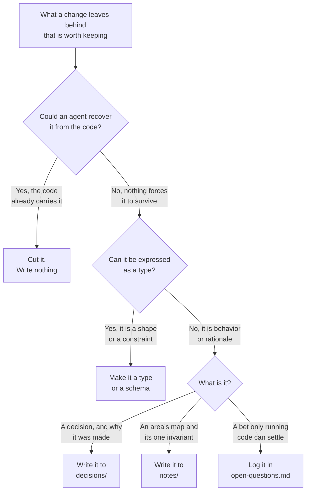
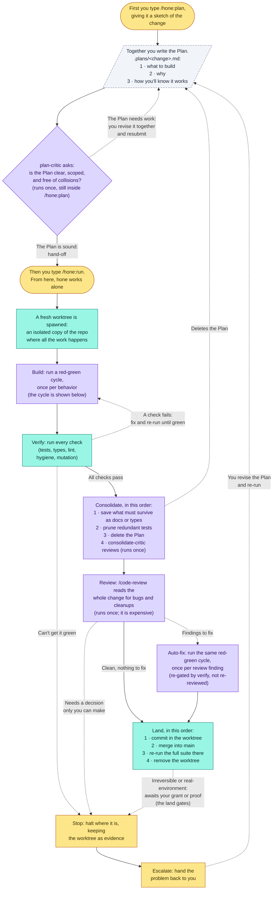
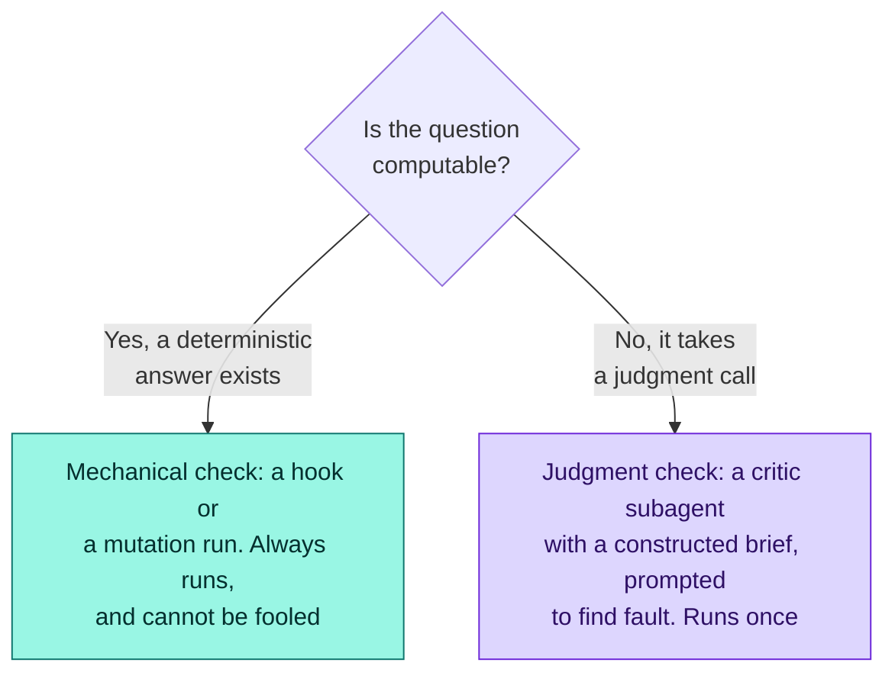

# hone: a development model for AI-written codebases

hone is a development model for codebases where an AI agent is a primary
writer *and* reader. It has two main characteristics. The *enforcement*
makes the work test-driven: hooks apply the mechanical rules, and critic
agents make the judgment calls. The *honing* keeps the permanent
documentation small. Prose survives only in a form a checker catches, or
in a form too small to go stale unnoticed. And every change deletes
something. This page explains why the pieces exist. The operational
detail (commands, files, exit codes) is in [`reference.md`](reference.md).
Examples use TypeScript and Python, but the model is language-agnostic.

## The problem

Hand-maintained per-feature specs serve two purposes at once. They are
the temporary work ticket (what we are building now, and its criteria)
and the permanent description (how the system behaves today). Every batch
of work adds a file, and criteria only accumulate. The truth about one
feature ends up scattered across many documents. Nothing forces any of it
to stay in step with the code, so it goes stale. The result is a second
copy of the system's behavior with no checker attached.

## Principles

Together, the two characteristics give discipline without a corpus: the
hooks enforce test-first work, and nobody maintains a permanent pile of
per-feature specs. Each characteristic carries its own principles.

The honing:

1. *Permanent docs live only where staleness gets caught.* Everything
   else is disposable.
2. *The cut test.* Never write down what an agent could work out from
   the code. If something can be a type, make it a type instead of
   prose.
3. *Deletion is routine.* Every change should remove something. This
   counterbalances a machine that otherwise only adds.

The enforcement:

4. *The human plans and automation executes.* After the plan, the loop
   runs unattended: hooks enforce the rules, and critic agents make the
   judgment calls. The loop stops and reports rather than forcing past a
   failed check.
5. *All work happens in a worktree.* The primary tree is a merge target,
   never a workspace.

## Artifacts

At consolidate, a fixed test routes whatever a change leaves behind that
is worth keeping (cut first, then type, then the smallest document that
fits):

```mermaid
flowchart TD
    r["What a change leaves behind<br/>that is worth keeping"] --> cut{"Could an agent recover<br/>it from the code?"}
    cut -->|"Yes, the code<br/>already carries it"| drop["Cut it.<br/>Write nothing"]
    cut -->|"No, nothing forces<br/>it to survive"| shape{"Can it be expressed<br/>as a type?"}
    shape -->|"Yes, it is a shape<br/>or a constraint"| type["Make it a type<br/>or a schema"]
    shape -->|"No, it is behavior<br/>or rationale"| kind{"What is it?"}
    kind -->|"A decision, and why<br/>it was made"| dec["Write it to<br/>decisions/"]
    kind -->|"An area's map and<br/>its one invariant"| note["Write it to<br/>notes/"]
    kind -->|"A bet only running<br/>code can settle"| oq["Log it in<br/>open-questions.md"]
```

*Committed and permanent. These survive the change:*

- *Types and schemas*: static types (TypeScript, or Python under mypy or
  pyright) and boundary schemas (Zod, Pydantic, JSON Schema, the DB
  schema). This is the strongest form, because a checker fails when code
  and contract disagree.
- *Code*: `src/<area>/`. The behavior itself.
- *Tests*: colocated by language convention, named for the behavior they
  pin. They both verify and document what the system does.
- *Decisions*: `docs/decisions/<topic>.md`. Present tense: the current
  decision and why. Record a rejected alternative when that stops a dead
  option from coming up again. One file per topic, edited in place,
  landing with the code it governs. An optional `Governs:` line names the
  `src/` paths the decision explains. The nag flags the file when a named
  path stops existing. That is how the hooks catch stale prose
  mechanically.
- *Notes*: `docs/notes/<area>.md`. An optional per-area map plus its one
  invariant. It points at the relevant Decision and the key types. One
  per existing `src/` area at most, size-capped, and its pointers can be
  a `Governs:` line too.
- *Open questions*: `docs/open-questions.md`. Assumptions only running
  code can settle. Consolidate closes or deletes an entry rather than
  letting entries accumulate.
- *Spikes*: `docs/spikes/<YYYY-MM-DD>-<slug>`, one dated stem holding
  everything one probe left behind, of any type: the note, the probe
  code, a mockup, a capture. This is the one artifact hone allows to go
  stale, and the date is what allows it. The note is past-tense history.
  It carries the question, the probe, the finding, and a forward pointer
  to the Decision or Note that holds the finding now. Nobody maintains a
  spike against the code. It never claims to describe the present, so it
  cannot mislead. Spikes are rare by design: most probes answer their
  question and leave nothing behind.
- *Git history*: what changed and why, at each point in time.

*Tracked but temporary. These go away when the change lands:*

- *The Plan*: `.plans/<change>.md`. The per-change brief: what to build,
  why, and how you will know it works. The only hand-written artifact.
  `plan` commits it so the run's worktree (created off the primary
  branch) contains it. Consolidate deletes it with `git rm`, so git
  history keeps it while the working tree does not.
- *References*: `.plans/<change>/`. Optional files the Plan names because
  prose carries them badly: a fixture of input/expected rows, a sample
  payload, a mockup. They exist because every gate in the loop catches a
  change that is *unproven*, while no gate catches one that is
  *misunderstood*. An ambiguous plan can pass every check and land green
  and wrong. A concrete file removes the second reading while the Plan's
  caller is still present. Each reference has two exits. Build promotes
  it next to the test that reads it, and from then on the suite keeps it
  correct. Or consolidate deletes it with the Plan.

*Not permanent, wherever it lives: the harness's own memory.* Claude Code
keeps per-project memory outside the repo, one file per fact. For facts
about the human, that store is fine and none of hone's business. A
project decision saved there fails every requirement this model sets for
permanent docs. It is per-user, uncommitted, unreviewed, and invisible to
the hooks, the critics, and `garden`, so nothing ever corrects it. The
nag flags such entries. The fix is to land the content in `docs/` through
consolidate, where review and later cuts can reach it.

*Outside the routing: forward-looking planning.* Everything above sorts
what a change *leaves behind*. A document about work nobody has started
leaves nothing behind, so none of these rules reach it, and a project may
keep one. hone keeps [`roadmap.md`](roadmap.md) for its own build-out.
Three limits stop such a document from becoming the pile this model
exists to prevent. It is one file. It describes work, never behavior,
because the code and the tests carry behavior. And it shrinks as the work
lands: whatever a landed change settles moves into a Decision at
consolidate, and the entry goes.

*Enforcement:* the guard, gate, nag, bash-guard, and dirty-guard hooks,
described in [`reference.md`](reference.md). In short: no production code
without a failing test, and no direct edits to protected paths in the
primary tree. Tests, type-check, and lint must be green before a turn
ends, and the hooks report hygiene findings visibly.

## The loop

The loop takes two commands and ends in a landed change, or in a question
handed back to you. The diagram below colors each node by actor, with the
Plan as the dashed parallelogram. A *user command* is amber. A
*mechanical step* is teal: a scripted step with the same result every
time. A *model step* is violet: a judgment call whose outcome can vary.
The Plan's whole life is on the diagram: created at `/hone:plan`, deleted
at consolidate.

```mermaid
flowchart TD
    cmdPlan(["First you type /hone:plan,<br/>giving it a sketch of the change"])
    planFile[/"Together you write the Plan.<br/>.plans/&lt;change&gt;.md:<br/>1 · what to build<br/>2 · why<br/>3 · how you'll know it works"/]
    cmdRun(["Then you type /hone:run.<br/>From here, hone works alone"])
    admit{"plan-critic asks:<br/>is the Plan clear, scoped,<br/>and free of collisions?<br/>(runs once, still inside /hone:plan)"}
    wt["A fresh worktree is spawned:<br/>an isolated copy of the repo<br/>where all the work happens"]
    build["Build: run a red-green cycle,<br/>once per behavior<br/>(the cycle is shown below)"]
    verify["Verify: run every check<br/>(tests, types, lint,<br/>hygiene, mutation)"]
    cons["Consolidate, in this order:<br/>1 · save what must survive as docs or types<br/>2 · prune redundant tests<br/>3 · delete the Plan<br/>4 · consolidate-critic reviews (runs once)"]
    rev["Review: /code-review reads the<br/>whole change for bugs and cleanups<br/>(runs once; it is expensive)"]
    fix["Auto-fix: run the same red-green cycle,<br/>once per review finding<br/>(re-gated by verify, not re-reviewed)"]
    land["Land, in this order:<br/>1 · commit in the worktree<br/>2 · merge into main<br/>3 · re-run the full suite there<br/>4 · remove the worktree"]
    esc["Escalate: hand the<br/>problem back to you"]
    stop["Stop: halt where it is, keeping<br/>the worktree as evidence"]

    cmdPlan --> planFile
    planFile --> admit
    admit -->|"The Plan is sound:<br/>hand-off"| cmdRun
    admit -.->|"The Plan needs work:<br/>you revise it together<br/>and resubmit"| planFile
    cmdRun --> wt
    wt --> build
    build --> verify
    verify -->|"All checks pass"| cons
    verify -.->|"A check fails:<br/>fix and re-run until green"| build
    verify -.->|"Can't get it green"| stop
    cons --> rev
    cons -.->|"Deletes the Plan"| planFile
    rev -->|"Clean, nothing to fix"| land
    rev -.->|"Findings to fix"| fix
    fix --> land
    rev -.->|"Needs a decision<br/>only you can make"| stop
    land -.->|"Irreversible or real-environment:<br/>awaits your grant or proof<br/>(the land gates)"| stop
    stop --> esc
    esc -.->|"You revise the Plan<br/>and re-run"| planFile

    classDef human fill:#fde68a,stroke:#b45309,color:#3f2d00;
    classDef deterministic fill:#99f6e4,stroke:#0f766e,color:#042f2e;
    classDef stochastic fill:#ddd6fe,stroke:#6d28d9,color:#2e1065;
    classDef artifact fill:#f1f5f9,stroke:#64748b,color:#1e293b,stroke-dasharray:5 3;
    class cmdPlan,cmdRun,esc,stop human;
    class wt,verify,land deterministic;
    class admit,build,cons,rev,fix stochastic;
    class planFile artifact;
```

Both `build` and `auto-fix` run the same red-green cycle, the loop's one
repeating unit, and the guard enforces its order:

```mermaid
flowchart TD
    ty["Types first:<br/>shape and constraints as types,<br/>invalid states impossible to express"]
    red["Red: write one failing test for<br/>an observable behavior, then run it"]
    q1{"Does it fail for<br/>the right reason?"}
    disc["Discard and rewrite it:<br/>a test that passes now was<br/>written after the code"]
    green["Green: write the minimum<br/>code to pass it, then run it"]
    q2{"Passing now?"}
    refac["Refactor what you just wrote,<br/>then run the unit tier"]
    q3{"Still all green?"}
    more{"Another behavior<br/>or finding to go?"}
    done(["Cycle done.<br/>Verify runs next"])

    ty --> red --> q1
    q1 -.->|"No, it passed or asserts nothing"| disc
    disc -.-> red
    q1 -->|"Yes, it fails correctly"| green
    green --> q2
    q2 -.->|"Not yet, write more"| green
    q2 -->|"Yes"| refac
    refac --> q3
    q3 -.->|"No, a check went red"| green
    q3 -->|"Yes"| more
    more -->|"Yes"| red
    more -->|"No"| done

    classDef stochastic fill:#ddd6fe,stroke:#6d28d9,color:#2e1065;
    classDef deterministic fill:#99f6e4,stroke:#0f766e,color:#042f2e;
    class ty,red,green,refac,disc stochastic;
    class done deterministic;
```

Plan is the one manual step, and sizing the change is its main judgment
call. Take the smallest unit worth its own review. Split only where a
reviewer could reject one part while approving the other.

Plan also starts from the code, not from the sketch. A change that alters
existing behavior states what that behavior is today, in one sentence
read from the files it will touch. Two readers need that sentence. The
loop is about to replace code it did not write. And consolidate deletes
the Plan, so the human at land time sees only the commit. A change that
opens a new area has no baseline to state, and the `plan-critic` asks for
none of this.

Rules that hold throughout: the artifacts confirm each step's completion,
never a subagent's claim that it finished. The artifacts are the diff,
the gate output, and the review's JSON envelope. A failed check is not a
stop. Only the build⇄verify cycle loops, as many times as it takes. The
loop may decline a confirmed review finding only when it contradicts the
Plan's explicit position or falls outside the change. It records the
decline where the decline survives: in the landing commit body, or as an
open question for a deferred defect. It never records the decline only in
conversation. The run stops in exactly three cases. Either verify
stays red after the fixes ran out, or the change is genuinely ambiguous,
or the work is complete. The human's response to a stop is to revise the Plan and
re-run, or to abandon the change. It is never to disable a check, and
never to hand-edit code mid-loop. The Plan is the only re-entry point.

A bug fix is the same loop. The first red test reproduces the defect
before the fix. A test written after the fix confirms nothing. A spike is
not the same loop: exploration runs in a throwaway worktree, and its
conclusion becomes a Decision or a Note, not committed code.

## Checking

There are two kinds of checker, and choosing the wrong kind is the main
failure:

```mermaid
flowchart TD
    q{"Is the question<br/>computable?"}
    q -->|"Yes, a deterministic<br/>answer exists"| mech["Mechanical check: a hook or<br/>a mutation run. Always runs,<br/>and cannot be fooled"]
    q -->|"No, it takes<br/>a judgment call"| judge["Judgment check: a critic subagent<br/>with a constructed brief, prompted<br/>to find fault. Runs once"]

    classDef deterministic fill:#99f6e4,stroke:#0f766e,color:#042f2e;
    classDef stochastic fill:#ddd6fe,stroke:#6d28d9,color:#2e1065;
    class mech deterministic;
    class judge stochastic;
```

Prefer the mechanical kind wherever the question is computable. That
includes the question of *whether* a judgment check has anything to
judge. `worktree.sh review-scope` reads the diff and prints `full` or
`docs-only`, and the loop skips `/code-review` only on the second word. A
change confined to `docs/` and `.plans/` gives a code reviewer no code to
read. The scoping is mechanical because "is this change small enough to
skip its review?" is exactly the judgment an unattended loop must not
make about itself. Size is not a signal there, and neither is "tests
only". A five-line change to a critical path gets the full review. A
weakened test is one of the things review exists to catch.

A judgment check gets a *constructed* brief (the diff, the Plan, the
relevant Decisions and Notes), never the writer's transcript. A reviewer
that inherits the writer's context is not an independent reviewer. There
are three judgment checks, and each runs once per change:

- `plan-critic`: placeholders, contradictions, ambiguity, scope, prose
  carrying data a file should carry, collisions with open changes. It
  runs inside `/hone:plan`, so its caller fixes a rejection on the spot,
  and no flawed plan reaches the unattended run.
- `consolidate-critic`: is a Decision just restating code? Has a Note
  grown into a spec? Is a test redundant? Is an abstraction worth its
  cost?
- `/code-review`: Claude Code's built-in review command, already
  multi-agent (parallel finders plus a verification pass), so the loop
  reuses it instead of shipping its own reviewer. It refuses model
  invocation, so the loop runs it as a print-mode user turn in a nested
  headless Claude Code.

These checks are the whole trust foundation of the unattended stretch.
The human's judgment sits before it (the Plan) and after it (auditing
what landed).

One part of that foundation can still go stale in silence: the prompts
themselves. The critic prompts, the run skill, and the injected workflow
rule are prose doing real work, and nothing type-checks a prompt.
`evals/` holds a suite of cases with known-good answers (a verdict for
each critic case, a next action for each loop case). Run it after any
change to that prose. The evals are also what make *cutting* prompt text
safe. As models improve, spelled-out instructions become unnecessary one
by one, but which ones is an empirical question. Trim, re-run, and keep
what holds. Without such a suite, a cut is a guess about future behavior.
That is why `garden` refuses to cut prompt files in repos that lack one.

### The proof boundary (land-time)

Everything above (suite, types, lint, property tests, mutation checks)
runs inside the repo, before the merge, and needs nothing from the
outside world. A green check therefore proves only what it asserts. It
can never prove a browser journey, a canary, or deployed health. For a
change whose real claim lives out there, "landed, tested, reviewed" is
not "proven".

So the Plan states the boundary explicitly: a Plan whose proof is user-
or ops-level declares `Proof: real-environment — <the check>`. (The
`plan-critic` rejects a plan whose named proof is categorically unable to
settle its claim.) `land` refuses such a change until a reviewed
real-environment check passes, or until whoever ran the check signs it
off. The loop signs off for a check it ran itself, and stops for one it
cannot reach. A sign-off naming a check nobody ran is evidence of
nothing. The landing commit copies that whole line, because consolidate
deletes the Plan and the trailer is all that reaches land. The sign-off
names the commit it covers, so it expires when new commits arrive.
Mechanics are in [`reference.md`](reference.md).

### Property-based tests (build-time)

A property test states a rule once (`parse(serialize(x)) == x`), and the
runner tries it against hundreds of random inputs. The writer therefore
cannot pick inputs that happen to pass. Use them for modules with a
universal invariant: parsers, serializers, pure transforms, especially on
critical paths. Skip them where no universal rule exists: UI,
orchestration, glue. They complement example tests. They do not replace
them.

### Mutation tests (verify-time)

Mutation testing plants small bugs on purpose and checks that some test
catches each one. It is the one judge of empty tests that nothing can
fool. That matters here because the same agent writes both the code and
the tests. Run it diff-scoped and budget-capped, on critical paths only.
Skip whole-suite runs (cost, noise) and UI behavior. It audits the tests,
not the code, and never gates a trivial change. Runner maturity varies
(StrykerJS for JS/TS, mutmut or cosmic-ray for Python).

Both techniques verify the work independently of its author. An agent can
game its own examples and its own self-review, but not random inputs or a
planted bug.

## Authority

What the agent *can* touch (the guard and bash-guard) and what an
unattended merge *may* do are separate questions. hone deliberately does
not delegate the second to the model. The dividing line is
reversibility. `git revert` undoes a bad reversible change (a logic bug,
a wrong refactor). Its cost stays bounded, so it lands unattended, as the
vast majority do. Reverting the merge does not undo an irreversible
change (a dropped column, a destructive backfill): the data is already
gone. For that subset, green-and-reviewed is necessary but not
sufficient. Somebody has to read the diff and say yes in writing.

So `land` classifies the diff mechanically (destructive SQL, `db/`
deletions, plus any glob the project declares). It refuses an
irreversible change until a grant exists for it. The grant is one file
for one change, revocable by deleting it. The merge commit body records
its text, so the authorization ends up in history rather than in a chat
log.

The loop may record that grant itself, after reading the diff the refusal
printed. What the gate buys is not a person's presence. It is the forced
stop, the reading, and the sentence that lands in history naming what is
irreversible and why it is right anyway. The stamp says whether the agent
or a person signed, so a later audit can separate them. A diff that does
something the Plan never asked for is an escalation, not a grant. Both
guards still deny every route into `.hone-grant/` except the helper,
which is what stamps the record. Mechanics are in
[`reference.md`](reference.md).

## Types and abstractions

Anything expressible as a type belongs in a type: an interface, a
constraint, an invalid state made impossible to express. (Examples: a
discriminated union in TypeScript, a `Literal` in Python.) Types carry
shape and constraint. Behavior stays in tests, and why stays in
Decisions.

The failure mode of types is over-abstraction, not staleness, and no
checker flags it. A type checker verifies that a type is correct, never
that it was worth building. So the workflow judges abstractions when a
change touches them, not in proactive passes (a search for things to
abstract produces premature abstractions):

- At *build*, friction is the signal. Rule of three: duplicate until the
  abstraction proves itself.
- At *consolidate*, the `consolidate-critic` asks whether the change
  *revealed* a wrong abstraction: a generic with one caller, two types
  that should merge. This named slot matters because nothing else forces
  the question.
- Nothing manages what no change touches, because a bad abstraction only
  costs at change time. Exception: friction on the same foundational type
  across several changes deserves a deliberate, Decision-level look.

## Many changes at once

Parallelism is just `run` over several plans, each in its own worktree,
landed one at a time. Three rules:

- *Within a change, the loop is serial.* Each red-green cycle learns from
  the last. The unit of parallelism is the change.
- *The run checks independence before fan-out, never assumes it.* Each
  `plan-critic` ran before the later plans existed, so `run --all` first
  compares the whole set and partitions it. The comparison covers
  expected files and areas, shared types and persistent contracts, and
  Decisions and Notes more than one plan touches. Disjoint plans run in
  parallel. Overlapping plans run sequentially, and each lands before the
  next starts.
- *The merge verifies the partition.* A collision at land (exit 9) means
  the check missed an overlap. The run then folds the colliding changes
  into one serial change. After all merges, one global consolidate pass
  looks for cross-change duplication no single worktree could see.

## Continuous maintenance

`plan → run` cleans up at the point of change, but staleness also builds
up *between* changes, in the parts nothing touches. Examples: a Decision
whose code moved, a Note nobody re-checked, a test a later change made
redundant, an open question that running code has answered. No
diff-scoped hook can see any of that.

`garden` (`/hone:garden`) closes the gap. It scans the whole repo for
that staleness and lands the safe removals through the same worktree
loop, one at a time. Two properties keep it safe. It is *deletion-only*:
a garden change removes and never adds. And it is *self-verifying*,
because the suite is the proof. A deletion that keeps the suite green
removed something dead. One that turns it red removed something
load-bearing, and garden abandons it. Judgment calls (is this Decision
stale, or rationale the code cannot show?) go to the
`consolidate-critic`. What only a human can settle gets logged or
escalated, never guessed. You invoke it, between changes: hone owns the
loop, and you choose when it runs. Small, frequent passes work better
than one large pass.

## The always-on rule

`rules/workflow.md`, injected at session start, is a pointer, not a
manual: a few paragraphs naming the workflow and its invariants. It stays
short on purpose. A long always-on rule costs context in every session,
and the model stops following it as it grows. The operational detail
lives in the `plan`, `run`, and `garden` skills, which load only when
invoked. (In a single repo rather than a distributed plugin, the same
split works as a lean `CLAUDE.md` pointing at local skills.)

## Invariants

1. Each artifact has exactly one writer among the steps (the full grid is
   in [`reference.md`](reference.md)). Code and tests come only from
   *build*, and `docs/` prose only from *consolidate*. Only *consolidate*
   prunes permanent artifacts, or, between changes, the deletion-only
   *garden*. Exactly two steps empty `.plans/`: *build* promotes a
   reference out, and *consolidate* deletes the Plan and whatever
   remains. Work-in-progress therefore cannot leak into the permanent
   record, which is the structural cure for the spec pile.
2. Every `docs/` write passes the cut test (principle 2), and a Note
   passes two more: 1:1 with an existing area, and under the size cap.
   The hooks hold the correspondence and the size, and `/code-review`
   judges whether the area boundaries make sense.
3. The primary tree's protected artifacts change only through *land*, a
   merge, so no half-built change ever sits in the tree everything merges
   into. The one hand-authored exception is the Plan and its references
   (`.plans/` is not a protected path). *plan* commits them there, so the
   worktree inherits them and the landing merge can delete them.
